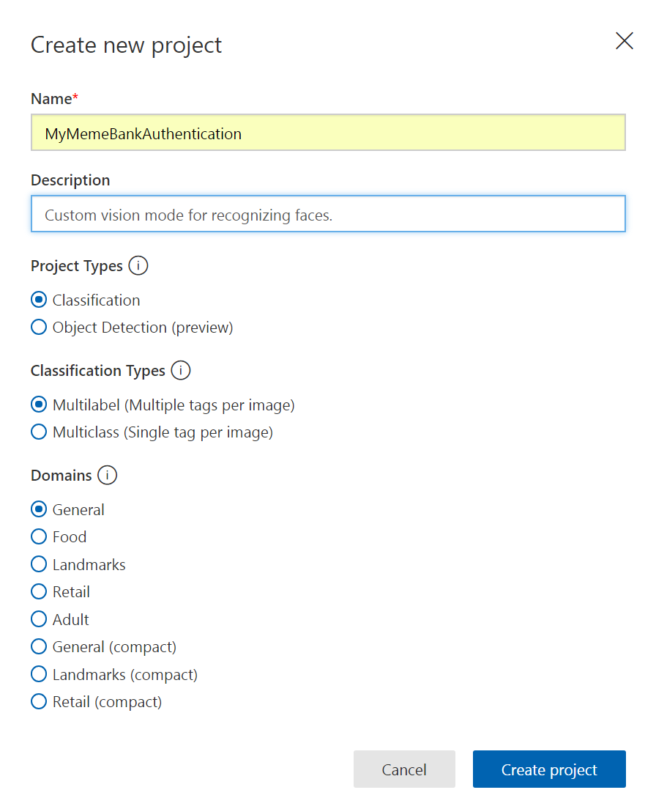
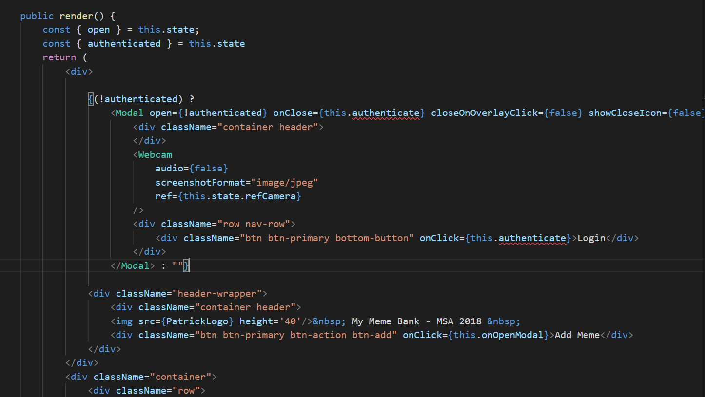
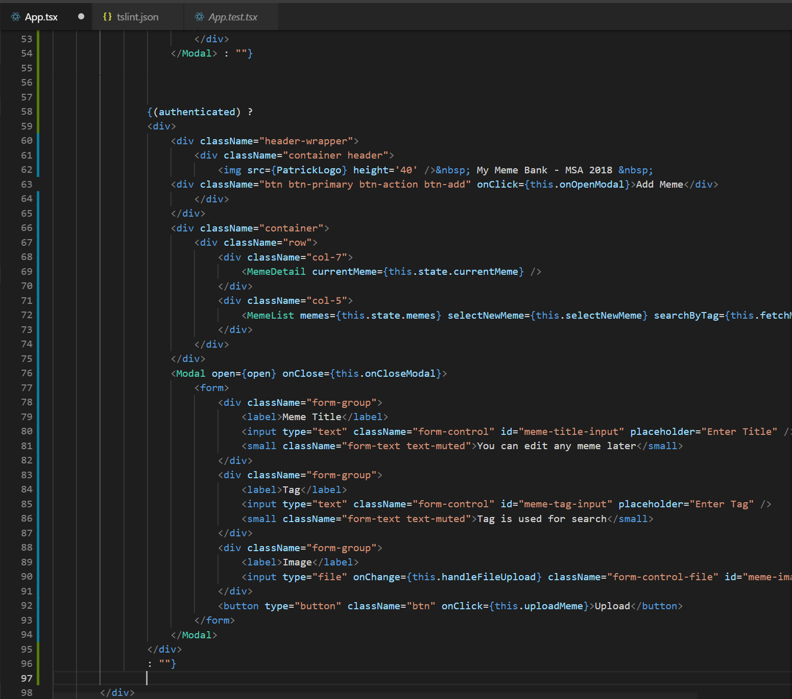

# Phase 2 Training 2018

## Overview

We will be creating a basic facial recognition authentication using Microsoft Azure custom vision service. This is to demonstrate how you can integrate and utilize Microsoft cognitive services in many unique ways.


### To do this session.
1. Create a new feature branch for authentication feature development on GitHub repository.
2. Set up custom vision project.
3. Add a camera inegration.
4. Integrate custom vision model 


## 1. Creating a new development branch.
Your master branch should be a production ready, bug free, and thoroughly tested, therefore we are going to be developing this feature on a seperate development branch.

In your repository, launch powershell or cmd.

```
$git status
#On branch master
$git checkout -b feature/authentication
$git status
#On branch feature/authentication
git branch --set-upstream feature/authentication
```
This creates a new branch locally and switch to it. As this branch is not on GitHub yet, Set-upstream will create this branch on GitHub.

Now we are ready for development. :)

## 2. Setup custom vision project.

Navigate to: https://www.customvision.ai/ and sign in with your account.

Enter a project name and description -> Create project.



We will revisit this soon.

## 3. Add camera integration
In this tutorial we will be integrating a camera into our react app using **react-webcam** package available on npm.

Reference: https://www.npmjs.com/package/react-webcam

1. In your repository, PowerShell or cmd

```
npm install @types/react-webcam
```
if this thorw an error 'Import sources within a group must be alphabetized.'

Add the following rules to 

2. Only after the user is authenticated then the website should be shown, therefore we will launch the camera on our main page. 

3. In App.tsx, we will make the following changes to add the camera. Add an import statement at the top to add webcam module.

```
import * as Webcam from "react-webcam";
```

4. We will add 2 new states to this **App.tsx** states interface. 
- **authenticated: boolean,**   #represent state whether the user is authenticated or not.
- **refCamera: any,**           #Store a reference pointer to the camera, allow us to invoke a method getScreenShot() later on.

```javascript
interface IState {
	currentMeme: any,
	memes: any[],
	open: boolean,
	uploadFileList: any,
	authenticated: boolean,
	refCamera: any
}
```
and set the states in the constructor as followed.

```javascript
class App extends React.Component<{}, IState> {
	constructor(props: any) {
        super(props)
        this.state = {
			currentMeme: {"id":0, "title":"Loading ","url":"","tags":"⚆ _ ⚆","uploaded":"","width":"0","height":"0"},
			memes: [],
			open: false,
			uploadFileList: null,
			authenticated: false,
			refCamera: React.createRef(),
		}     
```

Next we will add the camera and only show it if the user hasn't been authenticated. Add the following code above the header (MyMemeBank) of the main page.

```javascript
{(!authenticated) ?
	<Modal open={!authenticated} onClose={this.authenticate} closeOnOverlayClick={false} showCloseIcon={false} center={true}>
		<Webcam
			audio={false}
			screenshotFormat="image/jpeg"
			ref={this.state.refCamera}
		/>
		<div className="row nav-row">
			<div className="btn btn-primary bottom-button" onClick={this.authenticate}>Login</div>
		</div>
	</Modal> : ""}
```

<details><summary>Screenshot</summary>
<p>

</p>
</details>

The callback and method handler on **this.authenticate** are throwing an error as we haven't implemented the method yet. 

The code above essentially render the camera if state authentiated is false. We assign a reference to <Webcam /> so we can refer to it when we need.  

5. Implement authenticate method.
```javascript
// Authenticate
private authenticate() { 
	// const screenshot = this.state.refCamera.current.getScreenshot();
}
```
Add the method to **App.tsx**, and here we are able to get to our camera through refCamera reference object we defined and attached to <Webcam />. Invoke getScreenshot(); returns a Base64-encoded image. So when the user click login button, we can retrieve the image taken. 

Bind your method to the state at the top of the file.

```javascript
this.authenticate = this.authenticate.bind(this)
```
6. Skip rendering the main page.

Apply conditional statement to render the mainpage section only if you are authenticated. (After login). Surround the main page section with <div></div> so that we can apply a null

```javascript
{(authenticated) ?	
<div>
	<div className="header-wrapper">
		<div className="container header">
			&nbsp; My Meme Bank - MSA 2018 &nbsp;
	<div className="btn btn-primary btn-action btn-add" onClick={this.onOpenModal}>Add Meme</div>
					....................................
					
				<input type="file" onChange={this.handleFileUpload} className="form-control-file" id="meme-image-input" />
			</div>
			<button type="button" className="btn" onClick={this.uploadMeme}>Upload</button>
		</form>
	</Modal>
</div>
: ""}					

```

So if authenticated=true then state change, main page would be rendered instead of the <Webcam /> component.

<details><summary>Screenshot</summary>
<p>

</p>
</details>

## 4. Integrate custom vision model

1. Next we will implement an API call method to our custom vision model project endpoint.

```javascript
// Call custom vision model
private getFaceRecognitionResult(image: string) {
	const url = "[API-ENDPOINT]"
	if (image === null) {
		return;
	}
	const base64 = require('base64-js');
	const base64content = image.split(";")[1].split(",")[1]
	const byteArray = base64.toByteArray(base64content);
	fetch(url, {
		body: byteArray,
		headers: {
			'cache-control': 'no-cache', 'Prediction-Key': '[API-KEY]', 'Content-Type': 'application/octet-stream'
		},
		method: 'POST'
	})
		.then((response: any) => {
			if (!response.ok) {
				// Error State
				alert(response.statusText)
			} else {
				response.json().then((json: any) => {
					json.predictions[0]
				})
			}
		})
}
```
Examining this getFaceRecognitionResult() method, we are setting up a POST Http request to our custom vision model. 

We need to specify our API endpoint in which we will send our POST request to, using our API Key retreived from the portal.

2. Head to https://www.customvision.ai/ and login to your project. Upload a few selfies of yourself and potentially your friends.
- Hit the button **Train**.
- Click on Performance -> Prediction URL, and configure the **API-Key** and **URL endpoint** into your app.

3. Add the getFaceRecognitionResult to authenticate method and pass in the screenshot we took when the user click login.

```javascript
// Authenticate
private authenticate() {
	const screenshot = this.state.refCamera.current.getScreenshot();
	this.getFaceRecognitionResult(screenshot);
}
```

