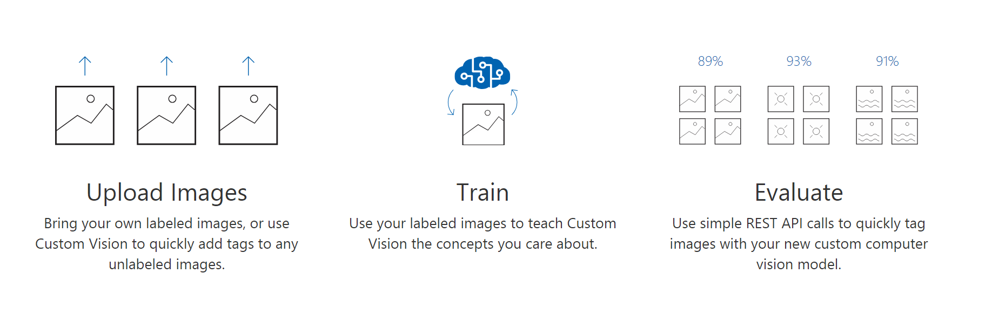
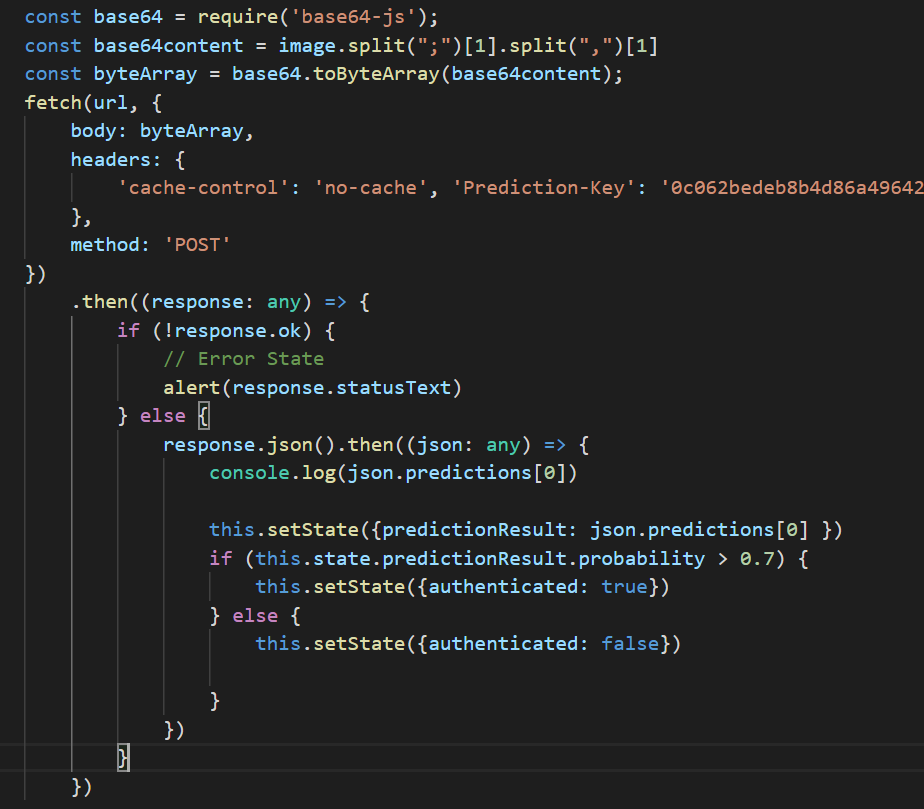

# Simple facial recognition using custom vision model

## Overview

We will be creating a basic facial recognition authentication using Microsoft Azure custom vision service. This is to demonstrate how you can integrate and utilize Microsoft cognitive services in many unique ways.



### To do this session.
1. Create a new feature branch for authentication feature development on GitHub repository.
2. Set up custom vision project.
3. Add a camera integration.
4. Integrate custom vision model 


## 1. Creating a new development branch.
Your master branch should be a production ready, bug free, and thoroughly tested, therefore we are going to be developing this feature on a seperate development branch.

In your repository, launch powershell or cmd.

```
$git status
#On branch master
$git checkout -b feature/authentication
$git status
#On branch feature/authentication
git branch --set-upstream feature/authentication
```
This creates a new branch locally and switch to it. As this branch is not on GitHub yet, Set-upstream will create this branch on GitHub.

Now we are ready for development. :)

## 2. Setup custom vision project.

Navigate to: https://www.customvision.ai/ and sign in with your account.

Enter a project name and description -> Create project.


We will revisit this soon.

*If you clone the complete project from the repo, make sure to add in API-Key and API-endpoint to the getFace

## 3. Add camera integration
In this tutorial we will be integrating a camera into our react app using **react-webcam** package available on npm.

Reference: https://www.npmjs.com/package/react-webcam

1. In your repository, PowerShell or cmd

Install Webcam component from npm.
```
npm install react-webcam
```

Install TypeScript type definition support for react-webcam.

```
npm install @types/react-webcam
```

Then we can now import and use the component in our project.

```
import * as Webcam from "react-webcam";
```

if this throws an error 'Import sources within a group must be alphabetized.'

Add the following rules to 

2. Only after the user is authenticated then the website should be shown, therefore we will launch the camera on our main page. 

3. In App.tsx, we will make the following changes to add the camera. Add an import statement at the top to add webcam module.


4. We will add 2 new states to this **App.tsx** states interface. 
- **authenticated: boolean,**   #represent state whether the user is authenticated or not.
- **refCamera: any,**           #Store a reference pointer to the camera, allow us to invoke a method getScreenShot() later on.

```javascript
interface IState {
	currentMeme: any,
	memes: any[],
	open: boolean,
	uploadFileList: any,
	authenticated: boolean,
	refCamera: any
}
```
and set the states in the constructor as followed.

```javascript
class App extends React.Component<{}, IState> {
	constructor(props: any) {
        super(props)
        this.state = {
			currentMeme: {"id":0, "title":"Loading ","url":"","tags":"⚆ _ ⚆","uploaded":"","width":"0","height":"0"},
			memes: [],
			open: false,
			uploadFileList: null,
			authenticated: false,
			refCamera: React.createRef(),
		}     
```

Next we will add the camera and only show it if the user hasn't been authenticated. Add the following code above the header (MyMemeBank) of the main page.

```javascript
public render() {
	const { open } = this.state;
	const { authenticated } = this.state
	return (
	
		<div>
		{(!authenticated) ?
			<Modal open={!authenticated} onClose={this.authenticate} closeOnOverlayClick={false} showCloseIcon={false} center={true}>
				<Webcam
					audio={false}
					screenshotFormat="image/jpeg"
					ref={this.state.refCamera}
				/>
				<div className="row nav-row">
					<div className="btn btn-primary bottom-button" onClick={this.authenticate}>Login</div>
				</div>
			</Modal> : ""}
```

<details><summary>Screenshot</summary>
<p>

</p>
</details>

The callback and method handler on **this.authenticate** are throwing an error as we haven't implemented the method yet. 

The code above essentially render the camera if the state authenticated is false. We also assign a reference to <Webcam /> so we can refer to it when we need.  

5. Implement authenticate method.
```javascript
// Authenticate
private authenticate() { 
	// const screenshot = this.state.refCamera.current.getScreenshot();
}
```
Add the method to **App.tsx**, and here we are able to get to our camera through refCamera reference object we defined and attached to <Webcam />. Invoke getScreenshot(); returns a Base64-encoded image. So when the user click login button, we can retrieve the image taken. 

Bind your method to the state at the top of the file.

```javascript
this.authenticate = this.authenticate.bind(this)
```

Now run the app to see if the camera appears.

6. Skip rendering the main page.

Apply conditional statement to render the mainpage only if you are authenticated. (After user logged in). Surround the main page section with <div></div> so that we can apply a ternary operator, if authenticated === true then we will render the mainpage.

```javascript
{(authenticated) ?	
<div>
	<div className="header-wrapper">
		<div className="container header">
			&nbsp; My Meme Bank - MSA 2018 &nbsp;
	<div className="btn btn-primary btn-action btn-add" onClick={this.onOpenModal}>Add Meme</div>
					....................................
					
				<input type="file" onChange={this.handleFileUpload} className="form-control-file" id="meme-image-input" />
			</div>
			<button type="button" className="btn" onClick={this.uploadMeme}>Upload</button>
		</form>
	</Modal>
</div>
: ""}					

```

So if authenticated=true then state change, main page would be rendered instead of the <Webcam /> component.

<details><summary>Screenshot</summary>
<p>

</p>
</details>

Run the app again to check if our mainpage has disappeared. 

## 4. Integrate custom vision model

1. Next we will implement an API call method to our custom vision model project endpoint.

```javascript
// Call custom vision model
private getFaceRecognitionResult(image: string) {
	const url = "[API-ENDPOINT]"
	if (image === null) {
		return;
	}
	const base64 = require('base64-js');
	const base64content = image.split(";")[1].split(",")[1]
	const byteArray = base64.toByteArray(base64content);
	fetch(url, {
		body: byteArray,
		headers: {
			'cache-control': 'no-cache', 'Prediction-Key': '[API-KEY]', 'Content-Type': 'application/octet-stream'
		},
		method: 'POST'
	})
		.then((response: any) => {
			if (!response.ok) {
				// Error State
				alert(response.statusText)
			} else {
				response.json().then((json: any) => {
					console.log(json.predictions[0])
				})
			}
		})
}
```
Examining this getFaceRecognitionResult() method, we are setting up a POST Http request to our custom vision model. 

We need to specify our API endpoint in which we will send our POST request to, using our API Key retreived from the portal.

2. Head to https://www.customvision.ai/ and login to your project. Upload a few selfies of yourself and potentially your friends.

Tag the photos with the name of a person. So the API returns the result as that person's name.

- Hit the button **Train**.
- Click on Performance -> Prediction URL, and configure the **API-Key** and **URL endpoint** into your app.

3. Add the getFaceRecognitionResult to authenticate method and pass in the screenshot we took when the user click login.

```javascript
// Authenticate
private authenticate() {
	const screenshot = this.state.refCamera.current.getScreenshot();
	this.getFaceRecognitionResult(screenshot);
}
```

Run the app, open the developer tool and goes to console -> Click 'Login', you should be able to see the the result of **console.log(json.predictions[0])** object output to the console (F12 on Chrome), which contains the name of the _person_, and the _probability_ of the prediction.

4. Authenticate if the user is found. 

In getFaceRecognitionResult we now **this.setState({authenticated: true})** if let say the prediction value returns is above 70% (0.7). And we can trigger different alert banner based on this value as well.

So, add the new states **predictionResult: any** to the interface at the top of the file to store return result, and set the state in the constructor.

Add the following logic to the **getFaceRecognitionResult()**, where the resulting json object is returned from the request.

```javascript
response.json().then((json: any) => {
	console.log(json.predictions[0])
	this.setState({predictionResult: json.predictions[0] })
	if (this.state.predictionResult.probability > 0.7) {
		this.setState({authenticated: true})
	} else {
		this.setState({authenticated: false})
		
	}
})
```
<details><summary>Screenshot</summary>
<p>

</p>
</details>

Here, we are basically checking whether the user matches any tags in our custom vision model. The threshold probability can be set to however you like. 

If the user matches, then we simply set the state authenticated to True, then the page will now render our mainpage instead of the camera components.

Now test running your application.

**Note:** If you only train your custom vision model with one person, it may recognizes others as that person as well because there's simply a lot of similarity as a person. 

The more you train the model, the more accurate it will be.

**Good luck with phase-2 now go build some more wild features!**
